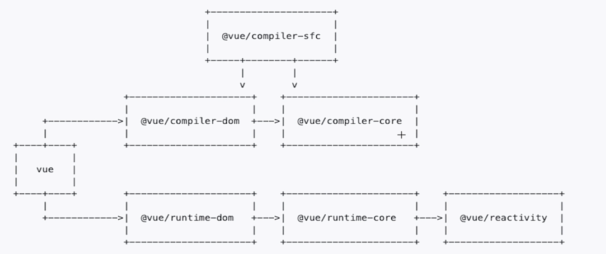
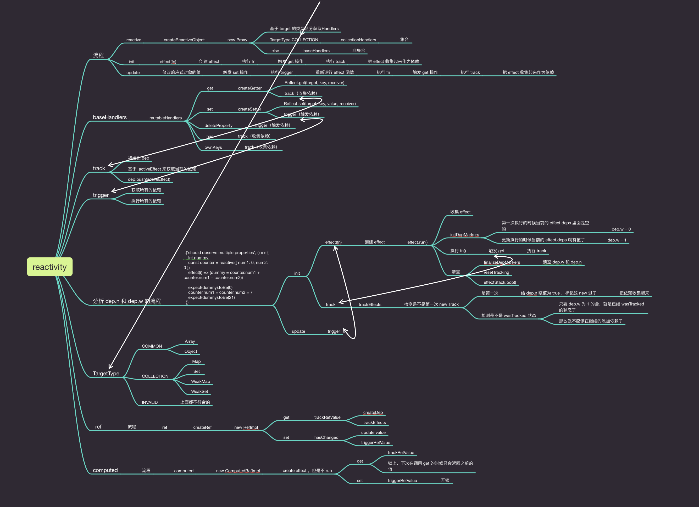

# Vue3 源码解析学习

这个文件夹作为一个笔记本记录PsChina的Vue3源码学习笔记。

课前预习 

1. [预习视频](https://www.bilibili.com/video/BV1Rt4y1B7sC)  [预习demo](./demos/demo01/)

1. [手写minivue](https://www.bilibili.com/video/BV1Rt4y1B7sC)

1. [脑图](./assets/mini-vue%E8%84%91%E5%9B%BE.zip)

1. [vue3源码结构的介绍](#vue3源码结构的介绍)

1. [reactivity核心流程](#reactivity-核心流程)

1. [runtime-core初始化的核心流程](#runtime-core-初始化的核心流程)

1. [runtime-core更新的核心流程](#runtime-core-更新的核心流程)

1. [setup环境-集成jest做单元测试-集成ts](#setup环境-集成jest做单元测试-集成ts)

1. [实现effect&reactive&依赖收集&触发依赖](./demos/demo03/)

1. [实现effect返回runner](./demos/demo04/)

1. [实现effect的scheduler功能](./demos/demo05/)

1. [实现effect的stop功能](./demos/demo06)

1. [实现readonly功能](./demos/demo07/)

## Vue3源码结构的介绍

Vue 模块结构




可以看到 `vue` 直接依赖 `@vue/compiler-dom` （处理编译） 和 `@vue/runtime-dom` （处理运行时）这两个模块。

其中 `@vue/compiler-dom` 底层又依赖了 `@vue/compiler-core` 这两个库互相配合使用用于支持解析vue组建，其中 `@vue/compiler-sfc` 是用于解析单文件组建`.vue`的 它依赖了  `@vue/compiler-dom`  以及  `@vue/compiler-core`。


`@vue/compiler-core` 用于处理 `tmeplate` 它会把 `template` 变成一个 `render` 函数。


`@vue/runtime-dom` 用于处理运行时。


`@vue/runtime-dom` 依赖 `@vue/runtime-core` ， `@vue/runtime-core` 用于处理核心运行时， `@vue/runtime-core` 依赖  `@vue/reactivity`, `@vue/reactivity` 实现了 vue 的响应式， 这几个库都可以独立使用。


`@vue/runtime-dom` 导出了 所有 `@vue/runtime-core` 和 `@vue/reactivity` 的 api 这个库用于确保vue的特性在运行时能够得到保证。

## reactivity 核心流程



reactive 的作用就是接收一个对象把它变成一个代理对象通过代理对象去访问原来对象的值，其内部实现了依赖收集（重写get）以及通知依赖更新（重写set）的功能

### get

通过调用 createGet 这个函数来创建 get 。

1. track 依赖收集

1. 返回值 `Reflect.get(target, key, receiver)`

### set

通过调用 createSet 这个函数来创建 set 。

1. 更新值 `Reflect.set(target, key, value,  receiver)`

1. trigger 通知更新


### effect

`effect` 接收用户给到的 function， 在function里面一般会存在一些计算和赋值操作。


当函数里面的 reactive 对象被获取值的 key 发生更新的时候 effect 会再次执行 从而达到被赋值的容器再次更新的目的。


`effect` 接收的函数后会以函数为参数创建一个 `ReactiveEffect` 对象将 函数存储在 `fn` 上 `fn` 会被`run`函数立即执行触发get操作。


`run` 在执行的过程中会更新 `activeEffect` 以便收集到对应的依赖 (在 `track` 中使用)


## update

当修改了相应式对象(`reactive-object`)的值的时候把所有收集到的 `effect` 执行一遍(`trigger`)


## runtime-core 初始化的核心流程

1. createApp 返回一个带有 mount 方法的对象

1. `mount`方法会基于根组件生成一个虚拟节点 （初始化开始）

1. `vnode` 含有 el 、 key 、 props 、 shapFlag 、 type 等属性

1. 其中 `type` 属性就是 `component` 

1. 调用 `render` 方法、`render` 方法内部 调用 `patch`
   
1. `patch` 方法会根据虚拟节点的不同类型（`type` 和 `shapeFlag`）来选择不同的处理方法

1. `patch` 遇到的 vnode 如果是组件类型 `component` 调用 `processComponent` 方法来处理

1. `processComponent` 内部会 根据 `n1` 是否存在来判断组件是否是首次渲染 如果是首次渲染则会调用 `mountComponent` 否则会调用 `updataComponent`

1. `mountComponent` 会通过 `createComponentInstance` 函数 创建一个 `component instance` 实例会包含 `ctx` 、 `emit` 、 `isMounted` 、`next` 、 `parent` 、`props` 、 `provides`、`slots` 、 `type` 、`vnode` 等属性 接下来会 `setupComponent` 以及 `setupRenderEffect`。

1. `setupComponent` 会初始化 `props` 、 `slots` 调用 `setupStateFulComponent` 这些过程都是在收集数据为以后的算法计算坐准备 （程序就是数据结构+算法）  设置 `render` 函数 

1. `setupStateFulComponent` 会 挂载 代理数据到 组件实例上 会调用 setup 函数并处理 setup 返回的数据

1. `setupRenderEffect` 会 判断实例对象是否初始化如果已经初始化了会调用更新逻辑 否则会 初始化 `render` 函数获取到 vnode

1. `setupRenderEffect` 在初始化组件的时候会继续 `patch` 子元素 (开启递归分析)

1. `patch` 方法遇到的 vnode 如果是 Element 类型的话会调用 `processElement` 方法来处理

1. `processElement` 同样会根据 `n1` 是否存在判断元素是否是首次渲染

1. `processElement` 初始化逻辑会调用 `mountElement` ，  `mountElement` 会调用 `createElement` （vue3可以自定义渲染器比如需要通过canvas渲染就可以通过更改createElement的内部实现来达到目的） 创建真实 `dom` 元素 有子节点会调用 `mountChildren` ，  `mountChildren` 内部遍历 `vnode` 并且调用 `patch` 递归渲染 接下里会处理 `props`（默认渲染器`hostPatchProp`），最后插入父节点; `mountElement` 如果发现是文本节点则会调用 `hostSetElementText` (默认渲染器) 插入文本

1. 最终递归挂载到根元素上


### 总结

1. patch 函数就是一个拆箱的过程

1. App 是一最大的一个箱子

1. 拆箱的过程中会拆解 为不同类型的子箱子 `Component`、`Element`、`Text` 等等

1. `Component` 初始化会生成为一个虚拟节点 (初始化组件信息调用render函数生成vnode)

1. 渲染vnode的过程中递归 `patch` 继续拆箱直到所有子元素拆解完毕生成为目标视图(默认为`dom`)


## runtime-core 更新的核心流程

1. 以在 setup 中新建一个 Ref 对象 count 并且在render函数中引用为例。

1. 响应式的值发生改变 (count++) 会触发 `effect` 函数执行 `componentUpdateFn`（instance update）

1. `componentUpdateFn` 通过 `isMounted` 判断进入 update 逻辑 重新调用实例的render函数获得 `nextTree` 

1. 拿到 `nextTree` 与 `preTree` 给到 `patch` 方法

1. `patch` 方法会根据 `nextTree` 也就是 `n2` 的类型来选择不同的处理方式  (与初始化逻辑一致)

1. 如果 `n2` 的类型是元素则会调用 `processElement` 

1. 在 `processElement` 中 如果 `preTree` 存在也就是 `n1` 存在则会调用 `updateElement` 逻辑

1. `updateElement` 会取出 `oldProps` 和 `newProps` 以及把 `n1` 的 `el` 给 `n2` 接下来会 `patchProps` `patchChildren`

1. `patchProps` 会对比新旧 props

1. 如果新的props和老的props不一样那么就会调用`hostPatchProp` 此时 prevProp 和 nextProp 都有值 更新 host 的 prop 的值

1. 如果老的props不存在于新的props那么就会调用`hostPatchProp` 此时 prevProp 有值 nextProp 为 null 也就是删除老的属性

1. 在 `patchChildren` 的过程中如果发现节点是文本类型那么会直接判断文本节点是否一致不一致的情况会调用 `hostSetElementText` 来更新文本节点

1. 如果发现节点类型是`ARRAY_CHILDREN`类型则会调用`patchKeyedChildren`来更新子节点

1. `patchKeyedChildren` 是一个比较复杂的 diff 算法

1. `patchKeyedChildren` 会进行双端对比去掉相同类型虚拟dom

1. 剩下来的则是类型不一致的的元素的精确范围 (c1、c2 为新旧集合 e1、e2 为集合长度 i 为对比指针索引 双端对比会改变 e1、e2 的大小从而避免修改没有改变的元素)

1. 如果 `i>e1 && i<=e2` 说明新节点大于就节点数量 则会调用 `patch(null,c2[i],container)` (i<=e2) 新建虚拟节点

1. 如果 `i>e2 && i<=e1` 说明新节点是小于旧节点的需要把多余的节点删除 调用 `hostRemove(c1[i].el)` (i<=e1) 删除真实dom节点

1. 以上处理完成了超出部分的新增或删除的元素接下来分析dom顺序变化

1. 一开始会收集所有新节点的key到一个Map里面 记录下key以及key对应的位置i (__Vue中key的意义__)

1. 然后会遍历所有老的虚拟节点挨个看老节点的key是否存在于新map里面 

1. 如果key存在于新老节点那么会对比更新 `patch(preChild,c2[newIndex],container)`

1. 如果key不存在于新节点（也就是newIndex===undefined）那么会删除这个真实dom `hostRemove(prevChild.el)`

1. 然后会遍历新节点key如果这个key不存在于老节点那么新增这个节点 `patch(null,c2[i],container)`

1. 如果都存在那么要则会更新节点的位置 `const anchor = i+1>= e2+1 ? null : c2[i+1]; hostInsert(nextChild.el,container,anchor&&anchor.el)` (没看明白😂)

1. 这样就完成了对比

    更新逻辑会在响应式的值改变的时候会触发 effect 执行 instance.update

    update 会把新的虚拟节点和老的虚拟节点进行一个对比,首先会对比 props 并且更新

    然后会对比 children 如果是 text 那么直接更新

    如果是 array 那么则会通过 diff 算法去算出来新增删除的元素以及元素位置的移动达到最小变动的目的


### 总结

1. 更新逻辑会在响应式的值改变的时候会触发。

1. 算出最小更新的点然后调用具体的渲染API更新即可。


## setup环境-集成jest做单元测试-集成ts

[项目demo](./demos/demo02/)
### 初始化项目

```bash
yarn init -y
```

### 目录结构

src>reactivity>index.ts


src>reactivity>tests>index.spec.ts

### 集成 jest

```
yarn add typescript --dev
```

### 初始化 tsconfig 文件 

```
npx tsc --init
```

### 解决ts报错

```bash
yarn add jest @types/jest --dev
```

在 tsconfig 配置一下

```json
{
 "types": ["jest"],   
}
```

### 配置脚本

package.json

```json
{
    "script":{
        "test":"jest"
    }
}
```

### 去除 ts any 类型报错

tsconfig.json
```json
{
     "noImplicitAny": false,
}
```

### 配置 esmodule 支持

Using Babel

```bash
yarn add --dev babel-jest @babel/core @babel/preset-env
```

Using babel with typescript

```bash
yarn add --dev @babel/preset-typescript
```

创建 babel.config.js

```js
module.exports = {
    presets: [
        ['@babel/preset-env', {targets: {node: 'current'}}],
        '@babel/preset-typescript',
      ],
}
```
